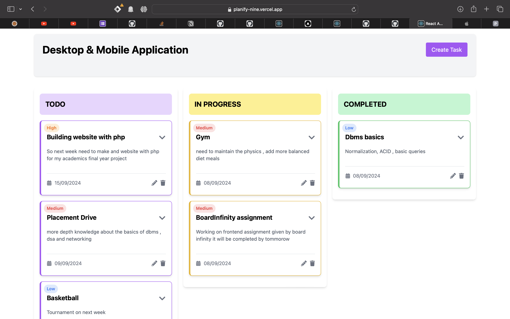

# Planify TodoList

The Planify project is a task management application designed to help teams track their work progress across different stages: TODO, IN PROGRESS, and COMPLETED. It leverages React for the frontend, Firebase Firestore for real-time database functionalities, and Material-UI for the design components.

## Features

- **Task Management**: Users can create, edit, and delete tasks.
- **Real-time Updates**: Changes are updated in real-time using Firebase Firestore.
- **Drag and Drop**: Tasks can be moved between different statuses using drag and drop.
- **Responsive Design**: The application is fully responsive and works on both desktop and mobile devices.

## Project Scope

The scope of this project includes:
- Developing a user-friendly interface for managing tasks.
- Implementing real-time data handling with Firebase.
- Providing drag-and-drop functionality for task status updates.

## Screenshots




## Video
Here's a brief video demonstrating the functionalities of the project:

<video width="600" controls>
  <source src="https://github.com/bunnysayzz/Planify/blob/main/video.mp4
  " type="video/mp4">
  Your browser does not support the video tag.
</video>


## Code Structure

- **Frontend**: The frontend is built using React. Key components include:
  - `TaskCard` for displaying individual tasks.
  - `TaskModal` for handling task creation and editing.
  - `Dashboard` as the main page that organizes tasks into columns based on their status.

- **Backend**: Firebase Firestore is used as the backend to store and manage tasks in real-time.

## Installation and Setup

To run this project locally:
1. Clone the repository.
2. Install dependencies:
   ```bash
   npm install
   ```
3. Start the development server:
   ```bash
   npm start
   ```

## Dependencies

- React
- Firebase
- Material-UI
- React DnD (Drag and Drop)
- Date handling with `date-fns`

For a detailed list of dependencies, refer to `package.json`.

Thanku For Visiting

## Contact

# For any queries or suggestions, feel free to reach out to me on 
[LinkedIn](https://www.linkedin.com/in/azharuddindev)

# visit my 
[portfolio](https://imazhar.vercel.app)

